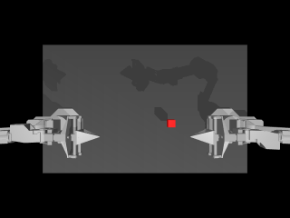

# Text-Conditioned Robotic Manipulation via VLA Policies



**ACT (left) vs SmolVLA (right)** — same seed, HUD overlays:


End-to-end **Physical AI** demo: MuJoCo Aloha bimanual manipulation + Hugging Face **LeRobot** policies (ACT for task success, **SmolVLA** for language conditioning), closed-loop rollout, multi-seed evaluation, and GIF export.

**PDF reports (Figma frameworks embedded):** [docs/pdf/](docs/pdf/)  
- [Full_Project_Report.pdf](docs/pdf/Full_Project_Report.pdf)  
- [Grid_Dynamics_Relevance_Brief.pdf](docs/pdf/Grid_Dynamics_Relevance_Brief.pdf)  
- [Frameworks_Atlas.pdf](docs/pdf/Frameworks_Atlas.pdf)  

**Full report (markdown):** [docs/FULL_REPORT.md](docs/FULL_REPORT.md)  
**Framework diagrams (FigJam):** [Figma board](https://www.figma.com/board/CmvFbnixCtXsehlEUMbEnZ)  
**Concept guide:** [docs/PROJECT_GUIDE.md](docs/PROJECT_GUIDE.md) · **Tech writeup:** [TECH_REPORT.md](TECH_REPORT.md)  
**Finetune:** [docs/FINETUNE_SMOLVLA.md](docs/FINETUNE_SMOLVLA.md) · **Real robot:** [docs/DEPLOYMENT_SO100.md](docs/DEPLOYMENT_SO100.md)

---

## Architecture

```
Language prompt ──┐
                  ├──► Policy (ACT | SmolVLA) ──► action (14,)
RGB top + qpos ───┘         policy.py                  │
     ▲                                                 │
     │                                                 ▼
MuJoCo camera ◄──── gym-aloha AlohaTransferCube ◄──────┘
env_wrapper.py           success <=> reward == 4
                              │
                              ▼
     demo_output.gif  +  eval_results.json  +  prompt_ablation.json
```

| Backend | Hub checkpoint | Language? | Role |
|---------|----------------|-----------|------|
| **ACT** | `lerobot/act_aloha_sim_transfer_cube_human` | No | Task success / GIF |
| **SmolVLA** | `crislmfroes/smolvla-aloha-sim-transfer-cube-scripted` | **Yes** | Prompt-conditioned actions |
| **Mock** | — | Hash embedding | FetchReach prototyping |

**Success criterion (Aloha TransferCube):** reward stages `0→1→2→3→4`; **success = reward 4**.

---

## Quick Start (Windows)

```bat
run.bat
```

or:

```powershell
.\.venv\Scripts\python.exe main.py --policy act --steps 400 --seed 0
.\.venv\Scripts\python.exe main.py --policy smolvla --prompt "Transfer the cube between the Aloha arms"
.\.venv\Scripts\python.exe evaluate.py --policy act --seeds 0-49 --steps 400 --continue-after-success
.\.venv\Scripts\python.exe prompt_ablation.py
.\.venv\Scripts\python.exe compare_policies.py --seed 36 --steps 400
.\.venv\Scripts\python.exe smoke_test.py
.\.venv\Scripts\python.exe export_mp4.py
.\.venv\Scripts\python.exe scripts\print_finetune_plan.py
```

### Next direction: SmolVLA finetune + hardware

- Finetune recipe (GPU): [docs/FINETUNE_SMOLVLA.md](docs/FINETUNE_SMOLVLA.md) · `scripts/finetune_smolvla.ps1`
- SO-100 sim→real appendix: [docs/DEPLOYMENT_SO100.md](docs/DEPLOYMENT_SO100.md)
- MP4 exports for decks: `demo_output.mp4`, `comparison_act_vs_smolvla.mp4`

### CI

GitHub Actions (`.github/workflows/ci-smoke.yml`) runs on every push/PR to `main`:

- install deps on Ubuntu + OSMesa
- 5-step ACT rollout
- SmolVLA `prompt_ablation` (`language_sensitive=true`)

### Create the venv (Python 3.11)

```bat
py -3.11 -m venv .venv
.\.venv\Scripts\python.exe -m pip install --upgrade pip
.\.venv\Scripts\python.exe -m pip install -r requirements.txt
```

---

## Evaluation (ACT)

```powershell
.\.venv\Scripts\python.exe evaluate.py --policy act --seeds 0-49 --steps 400 --continue-after-success
```

Writes `eval_results.json` + best-episode `demo_output.gif`.

| Metric | Value |
|--------|--------|
| Policy | `lerobot/act_aloha_sim_transfer_cube_human` |
| Env | `gym_aloha/AlohaTransferCube-v0` |
| Local CPU sweep (seeds 0–49, 400 steps) | **25/50 = 50.0%** success |
| Best seed (GIF) | `36` (reward 4, full transfer) |
| Hub reference | ~83% / 500 eps (official LeRobot GPU eval) |

Details: `eval_results.json`.

---

## Language conditioning (SmolVLA)

```powershell
.\.venv\Scripts\python.exe prompt_ablation.py --seed 0
```

Same RGB + state, two prompts → different first actions (`language_sensitive: true` in `prompt_ablation.json`).

Example (CPU, seed 0):

| Prompt A | Prompt B | Mean \|Δa\| (L1) |
|----------|----------|------------------|
| Transfer the cube… | Do nothing and keep both arms still | ~0.035 |

---

## Repository Layout

```text
Robotic_Arm/
├── requirements.txt
├── env_wrapper.py
├── policy.py            # ACT + SmolVLA + Mock
├── main.py
├── evaluate.py          # Multi-seed ACT/SmolVLA eval
├── prompt_ablation.py   # Language sensitivity check
├── compare_policies.py  # ACT vs SmolVLA side-by-side GIF
├── viz.py               # HUD overlays
├── TECH_REPORT.md       # 1-page portfolio writeup
├── smoke_test.py / export_mp4.py
├── docs/FINETUNE_SMOLVLA.md
├── docs/DEPLOYMENT_SO100.md
├── scripts/finetune_smolvla.{sh,ps1}
├── .github/workflows/ci-smoke.yml
├── run.bat / run.ps1
├── eval_results.json
├── prompt_ablation.json
├── comparison_report.json
├── demo_output.gif
├── demo_smolvla.gif
├── comparison_act_vs_smolvla.gif
└── README.md
```

---

## Design Notes

- Strict typing / docstrings; tensor shapes annotated inline.
- ACT Hub checkpoints: re-apply legacy `normalize_*` buffers under LeRobot 0.4.x.
- SmolVLA: Hub processors + tokenizer; config keys unknown to 0.4.2 are sanitized into `checkpoints/`.
- OOP split: env I/O, policy, orchestration / eval / ablation.

---

## License

Demo code for technical evaluation. Dependencies retain their respective licenses (PyTorch, Farama, MuJoCo, Hugging Face LeRobot).
